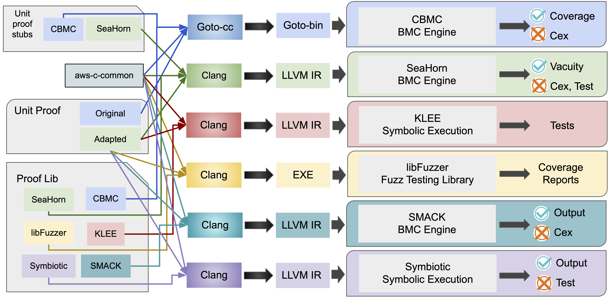

# verify-c-common


[](https://dev.azure.com/seahorn/verify-c-common/_build)
[](https://github.com/seahorn/verify-c-common/actions?query=workflow%3ACI)
[][fuzz]
[][data]

This repository contains the unit proofs as well as a build system used in the *Verifying Verified Code* case study. *Verified Code* refers to the [aws-c-common](https://github.com/awslabs/aws-c-common) library, which is now being verified by [CBMC](https://www.cprover.org/cbmc/) as part of the library's CI process. Read more about the AWS case study that inspired our work [here
](https://dl.acm.org/doi/10.1145/3377813.3381347). Instead of CBMC, our case study uses [SeaHorn](https://github.com/seahorn/seahorn)'s BMC engine for bounded model checking. We also adopted *de facto* semantics in the proofs and specifications, which allows this build system to use the same set of unit proofs for different verification tools and techniques. In specific, we enabled symbolic execution with [KLEE](https://klee.github.io/) and fuzzing with [libFuzzer](https://releases.llvm.org/10.0.0/docs/LibFuzzer.html).

# Results
Detailed analysis of run-times is available in an accompanying [Jupyter
Notebook][data] in Google Collab. Coverage reports from fuzzing are available
[here][fuzz].

[data]: https://colab.research.google.com/github/seahorn/verify-c-common/blob/master/experiment_results.ipynb
[fuzz]: https://seahorn.github.io/verify-c-common/fuzzing_coverage/index.html

# Publication(s)

1. Siddharth Priya, Xiang Zhou, Yusen Su, Yakir Vizel, Yuyan Bao, Arie Gurfinkel: [Verifying Verified Code](assets/paper_expanded.pdf). The 19th International Symposium on Automated Technology for Verification and Analysis ([ATVA 2021](https://formal-analysis.com/atva/2021/)) ([ArXiv](https://arxiv.org/abs/2107.00723)) ([Video](https://youtu.be/1TYTNXaI6PM?list=PLLMKcH6wIK2S42wjtFjNDg6AP4BTzH5Uu&t=6429))

2. Siddharth Priya, Xiang Zhou, Yusen Su, Yakir Vizel, Yuyan Bao, Arie Gurfinkel: [Bounded Model Checking for LLVM](assets/fmcad2022.pdf). The 22nd International Conference on Formal Methods in Computer-Aided Design ([FMCAD 2022](https://fmcad.org/FMCAD22/)).


# Architecture
Below is the high level architecture graph of our case study.


## Unit proof
A *unit proof* is a small piece of code (usually main function only) that verifies a function by doing the following:
- assumes pre-conditions regarding the function and data structure
- invokes a function under verification
- asserts post-conditions regarding the function and data structure

*Unit proofs* are organized under *verification jobs*. A *job* with *NAME* is placed under the directory `seahorn/jobs/NAME/`. A job directory contains a *unit proof* c file, `CMakeLists.txt` for CMake and an optional `sea.yaml` file containing job-specific configurations. An example unit proof for job `array_eq` has the *unit proof* [`aws_array_eq_harness.c`](./seahorn/jobs/array_eq/aws_array_eq_harness.c).

## Proof Library
The *proof library* contains helper functions that improves the expressiveness, efficiency and standardization of *unit proofs*. Examples include initialization functions for data structures and functions for expressing complex post-conditions. The *proof library* is located under [`seahorn/include/`](seahorn/include/) and [`seahorn/lib/`](seahorn/lib/).

## Unit proof stubs
To make verification scalable, the verification of method A that calls another method B may use a specification stub that approximates the functionality of B. We implemented these stub functions under [`seahorn/aws-c-common-stubs/`](seahorn/aws-c-common-stubs/).

# Installation
## Experiment with docker
The tool-specific builds for SeaHorn, KLEE and libFuzzer are containerized with docker for CI. You can also build these containers locally to replicate the verification results.

### SeaHorn
Dockerfile: [`docker/verify-c-common.Dockerfile`](docker/verify-c-common.Dockerfile).

To build and run all seahorn verification jobs:
```
$ docker build -t verify-c-common . --file docker/verify-c-common.Dockerfile
$ docker run -t verify-c-common /bin/bash -c "cd build && mkdir -p /tmp/verify-c-common && env VERIFY_FLAGS=\"<FLAGS>\" ctest -j<THREAD_NUM> --output-on-failure --timeout 2000"
```
Set `<FLAGS>` to a space delimited string to specify flags for every verification job. For example set `<FLAGS>` to `--cex --horn-bmc-solver=smt-y2` will run every job under counter example mode and use [Yices 2](https://yices.csl.sri.com/) as the SMT solver instead of [z3](https://github.com/Z3Prover/z3). More details on verification options can be found in [a later section](#basic-verification-options). Set `<THREAD_NUM>` to a number suitable for your machine to run verification jobs in parallel.

### SMACK
Dockerfile: [`docker/verify-c-common-smack.Dockerfile`](docker/verify-c-common-smack.Dockerfile).

To build and run all SMACK jobs:
```
$ docker build -t verify-c-common:smack . --file docker/verify-c-common-smack.Dockerfile
$ docker run -t verify-c-common:smack /bin/bash -c "cd build && ctest -R smack_ --timeout 2000"
```

### Symbiotic
Dockerfile: [`docker/verify-c-common-symbiotic.Dockerfile`](docker/verify-c-common-symbiotic.Dockerfile).

To build and run all Symbiotic jobs:
```
$ docker build -t verify-c-common:symbiotic . --file docker/verify-c-common-symbiotic.Dockerfile
$ docker run -t verify-c-common:symbiotic /bin/bash -c "cd build && ctest -R symbiotic_ --timeout 5000"
```

### KLEE
Dockerfile: [`docker/verify-c-common-klee.Dockerfile`](docker/verify-c-common-klee.Dockerfile).

To build and run all KLEE jobs:
```
$ docker build -t verify-c-common:klee . --file docker/verify-c-common-klee.Dockerfile
$ docker run -t verify-c-common:klee /bin/bash -c "cd build && ctest -R klee_ --timeout 2000"
```

### libFuzzer
Dockerfile: [`docker/verify-c-common-fuzz.Dockerfile`](docker/verify-c-common-fuzz.Dockerfile).

To build and run all libFuzzer jobs:
```
$ docker build -t verify-c-common:fuzz . --file docker/verify-c-common-fuzz.Dockerfile
$ docker run -t verify-c-common:fuzz /bin/bash -c "cd build && ctest -R fuzz_ --timeout 2000"
```

### aws-c-common
Dockerfile: [`docker/aws-c-common.Dockerfile`](docker/aws-c-common.Dockerfile).

To build and run all aws-c-common jobs by cbmc:
```
$ docker build -t aws-c-common:latest . --file docker/aws-c-common.Dockerfile
$ docker run -t aws-c-common:latest /bin/bash -c "cd scripts && python3 run_aws_res.py"
```
Note that, it will copy a python script [`run_aws_res.py`](scripts/run_aws_res.py) under the `scripts` folder in the container.

## Build locally with CMake and Clang-10


### Setup AWS-C-COMMON
This is a common step for all other configurations.

1. Clone [aws-c-common](https://github.com/awslabs/aws-c-common) project in the root directory of the project so that a
   sub-directory `aws-c-common` is created
   ```bash
   $ git clone https://github.com/awslabs/aws-c-common
   ```

2. Configure `aws-c-common` as instructed, make sure to compile with `clang-10` so that fuzzing can work. Configure using the following commands:
   ```bash
   $ cd aws-c-common
   $ mkdir build
   $ cd build
   $ cmake \
   -DCMAKE_C_COMPILER=clang-10 \
   -DCMAKE_EXPORT_COMPILE_COMMANDS=1 \
   -DCMAKE_INSTALL_PREFIX=$(pwd)/run ../ -GNinja
   ```

3. Build `aws-c-common` library:
   ```bash
   $ cmake --build . --target install
   ```
   or
   ```bash
   $ ninja install
   ```

## Build verification jobs for SeaHorn using CMake
As a prerequisite, follow [this guide](https://github.com/seahorn/seahorn/tree/dev10#developers-zone) to build SeaHorn locally.

1. Create a build directory
   ```bash
   $ mkdir build ; cd build
   ```
2. Configure with cmake
   ```bash
   $ cmake \
      -DSEA_LINK=llvm-link-10 \
      -DCMAKE_C_COMPILER=clang-10 \
      -DCMAKE_CXX_COMPILER=clang++-10 \
      -DSEAHORN_ROOT=<SEAHORN_ROOT> \
      -Daws-c-common_DIR=<AWS_C_COMMON_CMAKE_DIR> ../ -GNinja
   ```
   `SEAHORN_ROOT` is the directory containing your local SeaHorn repository. `AWS_C_COMMON_CMAKE_DIR` is the directory under `aws-c-common` project containing the file `aws-c-common-config.cmake`.
   
   Alternatively, the project can be configured using cmake presets. To do this, create a file in the root `verify-c-common` directory called `CMakeUserPresets.json`. On Linux, copy the contents of `default-jammy.json` into it. You will then have to replace `SEAHORN_ROOT` and `AWS_C_COMMON_CMAKE_DIR` with their corresponding directory paths in the presets file.
   
   Then, you can simply run:
   ```bash
   $ cmake --preset default
   ```
   to configure cmake. 
   
   This will also allow the project to be configured and compiled within VS Code using the CMake Tools extension.

   Alternatively, the project can be configured using cmake presets. To do this, create a file in the root `verify-c-common` directory called `CMakeUserPresets.json`. On Linux, copy the contents of `default-jammy.json` into it. You will then have to replace `SEAHORN_ROOT` and `AWS_C_COMMON_CMAKE_DIR` with their corresponding directory paths in the presets file.

   Then, you can simply run:
   ```bash
   $ cmake --preset default
   ```
   to configure cmake. 
   
   This will also allow the project to be configured and compiled within VS Code using the CMake Tools extension.

3. Compile
   ```bash
   $ ninja
   ```
   or
   ```bash
   $ cmake --build .
   ```
Compiled bitcode files are placed under `build/seahorn/jobs/<NAME>/llvm-ir/<NAME>.bc`

4. Verify
   ```bash
   $ ninja test
   ```
   or
   ```bash
   $ cmake --build . --target test
   ```
   or
   ```bash
   $ ctest
   ```
5. Run individual test
   ```bash
   $ ctest -R <TEST_NAME>
   ```
6. Run individual file manually
   ```bash
   $ ./verify [options] <BC_FILE_NAME> 
   ```

### Basic verification options

`--cex`: runs verification under counterexample(cex) mode. Cex mode changes configuration options
to yield more readable results if the result is `SAT` (one of the assertions failed). A counterexample harness file will also be generated at `/tmp/h.ll`. You can link the harness file with unit proof bitcode file with `$SEA cex` to create an executable counterexample:
`$SEA cex -m64 -g --only-strip-extern --keep-lib-fn --klee-internalize <BC_FILE_NAME> /tmp/h.ll -o debug`. Running in cex mode might negatively affect the verification
time, but could be very useful for debugging.

`--vac`: runs verification under vacuity(vac) mode. Vac mode checks whether any of the assertions are *vacuously true*, in other words whether any assertions are not reachable. It is recommended to always run verification jobs under vac mode when a new job returns `UNSAT` to check whether it is a false positive.

`--horn-bmc-solver=[smt-z3, smt-y2]`: chooses the smt-solver that will be used for BMC verification. Z3 is used by default; set this flag to `smt-y2` to choose Yices2 instead. Yices2 can sometimes yield a much shorter verification time under cex mode.

## Build and run verification jobs for SMACK
Leave `aws-c-common` library as is if you have already built verification jobs for SeaHorn.

As a prerequisite, build SMACK following [this guide](https://github.com/smackers/smack/blob/main/docs/installation.md). Note, we require to use [LLVM](http://llvm.org/) [10.0.1](https://releases.llvm.org/download.html#10.0.1). The last commit that SMACK supports LLVM 10 is [4894245](https://github.com/smackers/smack/commit/48942451a1f48e56442c70256f3f20d117f1b309).

Enter the verification build directory and reconfigure CMake to enable SMACK:
```bash
$ cmake \
   -DSEA_LINK=llvm-link-10 \
   -DCMAKE_C_COMPILER=clang-10 \
   -DCMAKE_CXX_COMPILER=clang++-10 \
   -DSEAHORN_ROOT=<SEAHORN_ROOT> \
   -DSEA_ENABLE_SMACK=ON \
   -Daws-c-common_DIR=<AWS_C_COMMON_CMAKE_DIR> \
   ../ -GNinja
```
Rebuild with:
```bash
$ cmake --build .
```
or
```bash
$ ninja
```

To run all SMACK tests:
```bash
$ ctest -R smack_
```

To run a individual test for job with `NAME`, find SMACK specific LLVM assembly file under `seahorn/jobs/NAME/llvm-ir/NAME.smack.ir/NAME.smack.ir.ll`.

Run with your local SMACK executable:
```bash
$ smack --check assertions --time-limit 300 --no-memory-splitting \
   --integer-encoding unbounded-integer --pointer-encoding unbounded-integer \
   seahorn/jobs/${NAME}/llvm-ir/${NAME}.smack.ir/${NAME}.smack.ir.bc
```
### SMACK experiment with different options
We have adapted SMACK by using different configurations supported by the tool, including options for ineger / pointer encoding, options for property checks, and options for its memory model. The shown one is the configuration which SMACK performs best as we collected.
All verification results by giving different options we collected and reasoning on a jupyter [notebook](https://colab.research.google.com/drive/1tr37scaF4zOrgAYHUBCYi5mk1vwKhF1n?usp=sharing).

## Build and run verification jobs for Symbiotic
Leave `aws-c-common` library as is if you have already built verification jobs for SeaHorn.

As a prerequisite, build Symbiotic following [this guide](https://github.com/staticafi/symbiotic#building-symbiotic-from-sources). Note, we require to use [LLVM](http://llvm.org/) [10.0.1](https://releases.llvm.org/download.html#10.0.1).

Enter the verification build directory and reconfigure CMake to enable Symbiotic:
```bash
$ cmake \
   -DSEA_LINK=llvm-link-10 \
   -DCMAKE_C_COMPILER=clang-10 \
   -DCMAKE_CXX_COMPILER=clang++-10 \
   -DSEAHORN_ROOT=<SEAHORN_ROOT> \
   -DSEA_ENABLE_SYMBIOTIC=ON \
   -Daws-c-common_DIR=<AWS_C_COMMON_CMAKE_DIR> \
   ../ -GNinja
```
Rebuild with:
```bash
$ cmake --build .
```
or
```bash
$ ninja
```

To run all Symbiotic tests:
```bash
$ ctest -R symbiotic_
```
Note, the CTest **does not** report error properly for Symbiotic. The verification result for Symbiotic should strictly follow the outputs of the tool.

To run a individual test for job with `NAME`, find Symbiotic specific BC file under `seahorn/jobs/NAME/llvm-ir/NAME.symbiotic.ir/NAME.symbiotic.ir.bc`.

Run with your local Symbiotic executable:
```bash
$ symbiotic --replay-error --report=short --prp=assert seahorn/jobs/${NAME}/llvm-ir/${NAME}.symbiotic.ir/${NAME}.symbiotic.ir.bc
```

### Issues we found
We reasoned why Symbiotic can take less times on verifying `priority_queue` and `ring_buffer` categories where other tools may take longer. We tried to add some failed assertions like `sassert(false)` (aka. `__VERIFIER_assert(false)`) on the proofs such as `priority_queue_push`, `priority_queue_push_ref`, and `priority_queue_s_swap`. However, Symbiotic still report no error found on all those cases. The details can be found on issue [124](https://github.com/seahorn/verify-c-common/issues/124).

## Build and run verification jobs for KLEE
Leave `aws-c-common` library as is if you have already built verification jobs for SeaHorn.

As a prerequisite, build KLEE following [this guide](https://klee.github.io/build-llvm9/). Note, we require to use [LLVM](http://llvm.org/) [10.0.1](https://releases.llvm.org/download.html#10.0.1).

Enter the verification build directory and reconfigure CMake to enable KLEE:
```bash
$ cmake \
   -DSEA_LINK=llvm-link-10 \
   -DCMAKE_C_COMPILER=clang-10 \
   -DCMAKE_CXX_COMPILER=clang++-10 \
   -DSEAHORN_ROOT=<SEAHORN_ROOT> \
   -DSEA_ENABLE_KLEE=ON \
   -Daws-c-common_DIR=<AWS_C_COMMON_CMAKE_DIR> \
   ../ -GNinja
```
Rebuild with:
```bash
$ cmake --build .
```
or
```bash
$ ninja
```

To run all KLEE tests:
```bash
$ ctest -R klee_
```

To run a individual test for job with `NAME`, find KLEE specific BC file under `seahorn/jobs/NAME/llvm-ir/NAME.klee.ir/NAME.klee.ir.bc`.

Run with your local KLEE executable:
```bash
$ klee --libc=uclibc --exit-on-error seahorn/jobs/${NAME}/llvm-ir/${NAME}.klee.ir/${NAME}.klee.ir.bc
```

## Build and run verification jobs for libFuzzer
As a prerequisite, install the following tools: `llvm-10 llvm-10-dev llvm-10-tools lcov`.
### Reconfigure and rebuild `aws-c-common`
We need to rebuild `aws-c-common` with fuzzing and coverage cflags.

Reconfigure:
```bash
$ cd aws-common/build/
$ cmake -DCMAKE_C_COMPILER=clang-10 \
  -DCMAKE_EXPORT_COMPILE_COMMANDS=1 \
  -DCMAKE_INSTALL_PREFIX=$(pwd)/run \
  -DCMAKE_C_FLAGS='-fsanitize=fuzzer-no-link,address,undefined -fprofile-instr-generate -fcoverage-mapping' \
  ../ -GNinja
```
Rebuild:
```bash
$ cmake --build . --target install
```
or
```bash
$ ninja install
```
Enter the verification build directory and reconfigure CMake to enable fuzzing:
```bash
$ cmake \
   -DSEA_LINK=llvm-link-10 \
   -DCMAKE_C_COMPILER=clang-10 \
   -DCMAKE_CXX_COMPILER=clang++-10 \
   -DSEAHORN_ROOT=<SEAHORN_ROOT> \
   -DSEA_ENABLE_FUZZ=ON \
   -Daws-c-common_DIR=<AWS_C_COMMON_CMAKE_DIR> \
   ../ -GNinja
```
Rebuild with:
```bash
$ cmake --build .
```
or
```bash
$ ninja
```

To run all libFuzzer tests:
```bash
$ ctest -R fuzz_
```

The fuzzing target executable for verification job `<NAME>` is installed as `build/seahorn/jobs/<NAME>/<NAME>_fuzz`. `build/seahorn/jobs/<NAME>/corpus/` will contain some corpus inputs generated by libFuzzer if any fuzzing runs are executed.
```bash
$ build/seahorn/jobs/<NAME>/<NAME>_fuzz -h
```
will show you all the options for libFuzzer.

To fuzz individual targets, run 
```bash
$ ASAN_OPTIONS=detect_leaks=0 build/seahorn/jobs/<NAME>/<NAME>_fuzz corpus -use_value_profile=1 -detect_leaks=0 -runs=<RUN_NUM> -allocator_may_return_null=1
```
This command will fuzz the target for at most `<RUN_NUM>` times or until a crash has occurred. Memory leak detection is turned off to prevent spurious memory leak warnings.

### Coverage report for fuzzing
We configured libFuzzer to output [source-based coverage](https://releases.llvm.org/10.0.0/tools/clang/docs/SourceBasedCodeCoverage.html) data. Once a target has been fuzzed for the desired number of times, `build/seahorn/jobs/<NAME>/corpus/` will contain some corpus input files. Running the fuzzing target again with `--runs=0` will make libFuzzer run the target with existing corpus files only and output coverage data.
```bash
$ ASAN_OPTIONS=detect_leaks=0 build/seahorn/jobs/<NAME>/<NAME>_fuzz corpus -detect_leaks=0 -runs=0
```
Now `build/seahorn/jobs/<NAME>/` should contain a profile data file named `default.profraw` containing coverage data.

After running all fuzzing tests, run `scripts/get_fuzzing_coverage.py` to output trace files of all source files under `data/fuzz_coverage/`. The file is readable and optionally by `lcov`. The script also supports generating HTML reports with the flag `--html-dir`.
```bash
$ python3 scripts/get_fuzzing_coverage.py --build-dir=<BUILD_DIR> --html-dir=<HTML_DIR>
```
